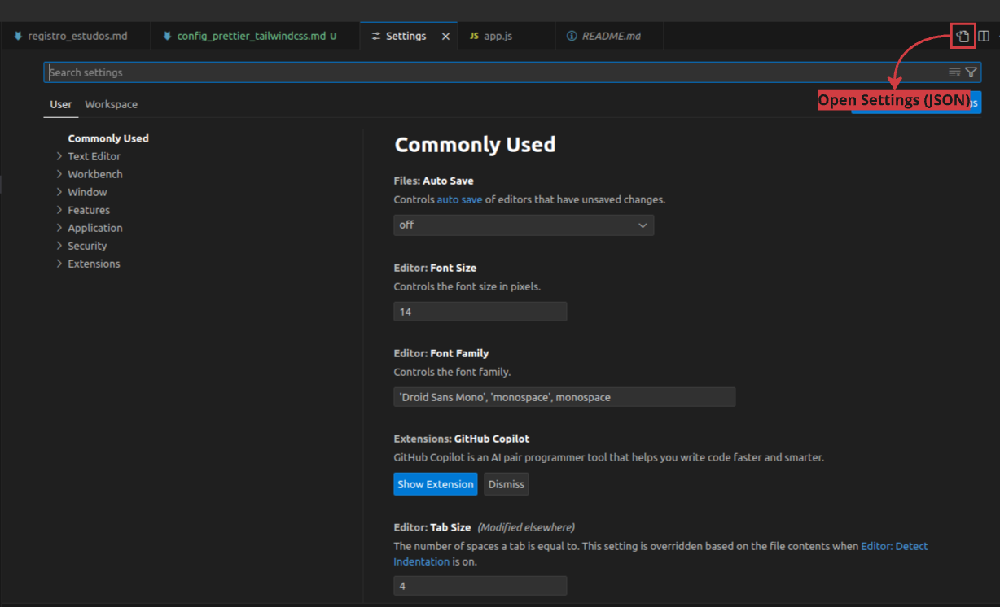

**Configuração do Prettier para Trabalhar com TailwindCSS no VS Code**

Se o plugin `prettier-plugin-tailwindcss` não estiver formatando corretamente ao salvar arquivos com classes TailwindCSS, siga as etapas abaixo:

**1. Instalar a Extensão Prettier no VS Code**

1. No VS Code, clique no ícone de extensões no lado esquerdo ou pressione `Ctrl + Shift + X`.
2. Pesquise por `"Prettier - Code formatter"` e instale a extensão.

**2. Configurar o Prettier como Formatador Padrão**

1. Vá para `Arquivo > Preferências > Configurações` (`File > Preferences > Settings`).
2. Clique no ícone de página com uma chave (`Open Settings (JSON)`) no canto superior direito da tela de configurações para abrir o arquivo `settings.json`.



3. Adicione as seguintes linhas ao seu arquivo `settings.json`:
   ```json
   {
     "editor.defaultFormatter": "esbenp.prettier-vscode",
     "editor.formatOnSave": true,
     "[javascript]": {
       "editor.defaultFormatter": "esbenp.prettier-vscode"
     },
     "[javascriptreact]": {
       "editor.defaultFormatter": "esbenp.prettier-vscode"
     },
     "[typescript]": {
       "editor.defaultFormatter": "esbenp.prettier-vscode"
     },
     "[typescriptreact]": {
       "editor.defaultFormatter": "esbenp.prettier-vscode"
     }
   }
   ```

**3. Reinicie o VS Code**

**4. Abra um arquivo JavaScript, JSX, TypeScript ou TSX com classes TailwindCSS e salve-o para aplicar a formatação.**
