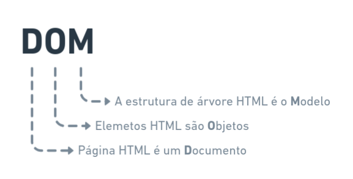
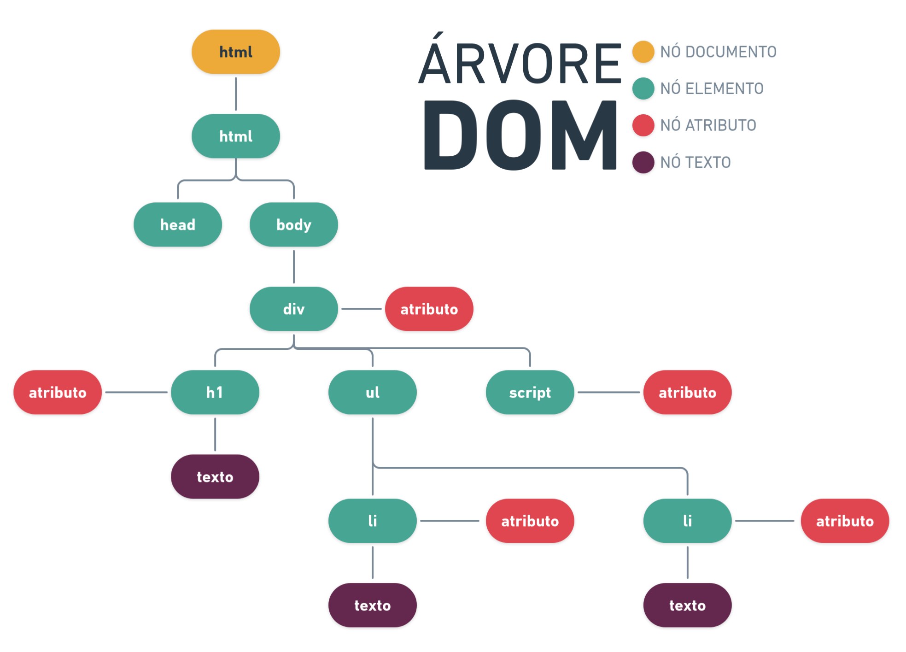

# Document Object Model (DOM)

## Sumário

- [Introdução](#introducao)
- [Tipos de dados](#tipos-de-dados)

---

## Introdução

O Document Object Model (DOM) é uma representação orientada a objetos que transforma um documento em um conjunto de objetos. Essa representação permite acessar e manipular de forma dinâmica a estrutura, o estilo e o conteúdo do documento através de uma linguagem de script como JavaScript. O DOM é independente de linguagens específicas de programação.

O DOM fornece uma interface de programação para documentos web, representando-os como uma árvore de objetos. Com isso, é possível acessar e manipular propriedades, métodos e eventos. O DOM moderno inclui um conjunto de APIs para controlar e construir essa estrutura.

Em resumo, o DOM facilita a compreensão e interação com páginas web ou documentos HTML/XML e seus componentes.

## Tipos de dados

> [!NOTE]
>
> É comum se referir aos nós no DOM como **elementos**, pois, em um documento HTML, cada nó é um elemento.

| Tipos de dados (interface)  | Descrição |
|-----------------------------|-----------|
| Document                    | É criado para cada página carregada no navegador e atua como o ponto de entrada para o conteúdo da página, incluindo a árvore DOM. Todo `Document` implementa as interfaces `Document`, `Node` e `EventTarget`. |
| Node                        | Em um documento HTML, todo objeto é um nó que pode ser do tipo elemento, texto ou atributo. |
| Element                     | Representa um elemento HTML, que pode ter atributos e filhos, e é um tipo específico de `Node`. |

Referências:
- [MDN Web Docs - Introduction to the DOM](https://developer.mozilla.org/pt-BR/docs/Web/API/Document_Object_Model/Introduction)
- [AK Coding - Virtual DOM in React JS](https://akcoding.com/virtual-dom-in-react-js/)
