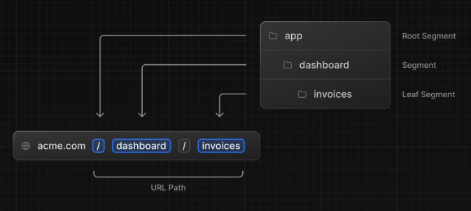
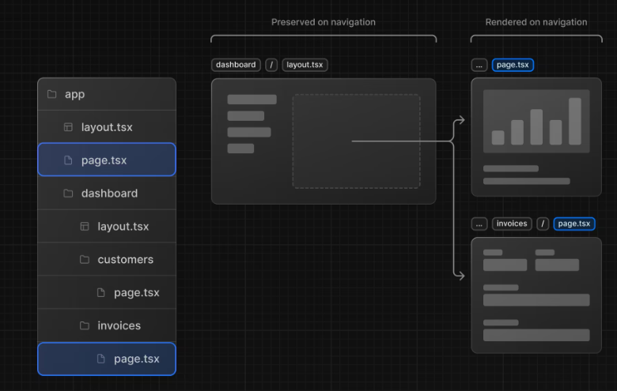

# Registro de Estudo Diário

## Sumário

- [Dia 01 - Estudo do Capítulo 1 e 2 de Next](#07082024)
- [Dia 02 - Estudo do Capítulo 3 e 4 de Next](#08082024)
- [Dia 03 - Estudo do Capítulo 5 e 6 de Next](#09082024)
- [Dia 04 - Estudo do Capítulo 7 e 8 de Next](#10082024)
- [Dia 05 - Estudo do Capítulo 9 de Next](#11082024)

---

## 07/08/2024

### Capítulos Estudados

#### 1. **Capítulo 1: Começando**

- **Principais Aprendizados:**

  - Utilização de `pnpm`
  - Criação de projetos com `create-next-app`
  - Exploração e estrutura do projeto
  - Uso de dados de espaço reservado
  - Integração com TypeScript
  - Execução do servidor de desenvolvimento

- **Resumo:**

  Ao criar um novo projeto Next.js, recomenda-se utilizar o gerenciador de pacotes `pnpm` por ser mais rápido e eficiente que `npm` ou `yarn`. Para iniciar o projeto, utiliza-se o comando `npx create-next-app`, que configura automaticamente um aplicativo Next.js, incluindo a opção de adicionar um exemplo preexistente para facilitar o aprendizado.

  - **Estrutura de Pastas:**

    - **/app:** Contém as rotas, componentes e lógica principal do aplicativo.
    - **/app/lib:** Armazena funções reutilizáveis e de busca de dados.
    - **/app/ui:** Inclui os componentes de interface de usuário pré-estilizados.
    - **/public:** Guarda os ativos estáticos, como imagens.
    - **Arquivos de configuração:** Configurações como `next.config.js` são geradas automaticamente e não necessitam de alterações.

  - **Dados de Espaço Reservado:**

    Para desenvolvimento, é possível usar dados de espaço reservado em formato JSON ou como objetos JavaScript. No projeto, os dados de placeholder são fornecidos no arquivo `/app/lib/placeholder-data.ts`, representando tabelas que serão usadas na inicialização do banco de dados.

  - **Uso do TypeScript:**

    O projeto está escrito em TypeScript, garantindo a integridade dos tipos de dados e evitando erros comuns, como passar o tipo de dado incorreto para componentes ou banco de dados.

  - **Execução do Servidor de Desenvolvimento:**

    Após instalar os pacotes com `pnpm i`, o servidor de desenvolvimento é iniciado com `pnpm dev`, rodando na porta 3000. A página inicial será exibida no navegador ao acessar `http://localhost:3000`.

#### 2. **Capítulo 2: Estilo CSS**

- **Principais Aprendizados:**

  - Estilos globais
  - Uso do Tailwind CSS
  - Módulos CSS
  - Biblioteca `clsx`
  - Outras opções de estilização

- **Resumo:**

  Neste capítulo, foram abordadas diferentes maneiras de estilizar um aplicativo Next.js:

  - **Estilos Globais:**
    A pasta `/app/ui` contém um arquivo `global.css` que pode ser usado para adicionar regras CSS globais, como redefinições e estilos para elementos HTML. O arquivo deve ser importado no layout raiz do aplicativo (`layout.tsx`).

  - **Tailwind CSS:**
    É uma estrutura CSS que permite a aplicação rápida de estilos através de classes utilitárias diretamente no código JSX. Ao iniciar um novo projeto com `create-next-app`, o Next.js oferece a opção de configurar automaticamente o Tailwind. As classes Tailwind são aplicadas individualmente a cada elemento, facilitando a manutenção e evitando colisões de estilo.

  - **Módulos CSS:**
    Oferecem uma alternativa ao Tailwind, permitindo que estilos sejam definidos de forma escopada para cada componente. Os módulos CSS geram nomes de classes exclusivos automaticamente, evitando conflitos de estilo.

  - **Biblioteca `clsx`:**
    Permite alternar nomes de classes de forma condicional com base em estados ou outras condições, sendo útil para a estilização condicional de elementos.

  - **Outras Opções:**
    Além das abordagens mencionadas, é possível utilizar Sass para importar arquivos `.css` e `.scss`, bem como bibliotecas CSS-in-JS, como `styled-jsx`, `styled-components` e `emotion`.

  Essas técnicas oferecem flexibilidade para estilizar aplicativos Next.js de acordo com as preferências do desenvolvedor, possibilitando até o uso combinado de diferentes abordagens no mesmo projeto.

---

## 08/08/2024

### Capítulos Estudados

#### 1. **Capítulo 3: Otimização de Fontes e Imagens**

- **Principais Aprendizados:**

  - Adição de fontes personalizadas com `next/font`
  - Otimização de fontes para melhorar o desempenho
  - Adição de imagens com `next/image`
  - Otimização de imagens para evitar mudanças de layout e garantir responsividade

- **Resumo:**

  No desenvolvimento de aplicações Next.js, a otimização de fontes e imagens desempenha um papel crucial na melhoria da experiência do usuário e do desempenho do site. O Next.js facilita a adição e otimização de fontes personalizadas através do módulo `next/font`, que baixa os arquivos de fonte durante a compilação e os hospeda junto aos ativos estáticos, eliminando a necessidade de requisições de rede adicionais.

  - **Adição de Fontes Personalizadas:**

    - **Fonte Primária:** A fonte 'Inter' do Google Fonts é adicionada ao aplicativo importando-a no arquivo `fonts.ts` e aplicando-a globalmente ao `<body>` no arquivo `layout.tsx`.
    - **Fonte Secundária:** A fonte 'Lusitana' é importada e aplicada a elementos específicos, como parágrafos, com a possibilidade de especificar diferentes pesos de fonte.

  - **Otimização de Imagens:**

    O Next.js permite a otimização automática de imagens através do componente `next/image`, que previne mudanças de layout durante o carregamento, redimensiona imagens para diferentes dispositivos e carrega imagens fora da janela de visualização de forma progressiva.

    - **Imagem Hero:** Duas versões da imagem hero (desktop e mobile) são adicionadas ao projeto, com a versão apropriada sendo exibida conforme o dispositivo do usuário. As dimensões são definidas para evitar mudanças de layout e garantir que a imagem correta seja exibida no dispositivo correspondente.

  A aplicação de fontes personalizadas e a otimização de imagens com Next.js contribuem significativamente para uma experiência de usuário mais fluida e um melhor desempenho geral do site. Essas práticas são essenciais para o desenvolvimento moderno, onde o desempenho e a responsividade são cruciais.

#### 2. **Capítulo 4: Criando Layouts e Páginas**

- **Principais Aprendizados:**

  - Criação de rotas aninhadas usando o roteamento do sistema de arquivos
  - Uso de layouts aninhados para compartilhar UI entre várias páginas
  - Entendimento de colocation, renderização parcial e layout raiz
  - Prática de criação de páginas adicionais no painel

- **Resumo:**
  Neste capítulo, o foco é expandir o aplicativo para além da home page, criando rotas adicionais e estruturando o layout de forma eficiente. O Next.js permite o roteamento aninhado utilizando o sistema de arquivos, onde cada pasta representa um segmento de rota correspondente a uma URL.

  - **Roteamento Aninhado:**

    - Pastas dentro do diretório `app` são usadas para criar rotas. O arquivo `page.tsx` em cada pasta é necessário para que a rota seja acessível. Por exemplo, a rota `/dashboard` é associada ao arquivo `/app/dashboard/page.tsx`.

    

  - **Criando a Página do Painel:**

    - Para criar novas rotas, basta adicionar uma pasta com um arquivo `page.tsx`. O conteúdo desse arquivo define a interface acessível publicamente. É possível organizar componentes de UI e outros códigos relacionados em pastas adicionais dentro de `app`.

  - **Prática: Criando Páginas Adicionais no Painel:**

    - Duas novas páginas são criadas como prática: uma página de clientes e uma página de faturas, acessíveis em URLs específicas dentro do painel.

  - **Criando o Layout do Painel:**

    - Layouts no Next.js permitem compartilhar elementos de navegação entre várias páginas. Isso é feito com o arquivo `layout.tsx`, onde componentes como um menu de navegação são importados e aplicados a todas as páginas aninhadas.
    - A renderização parcial é um benefício desse sistema, permitindo que apenas os componentes da página sejam atualizados durante a navegação, mantendo o layout intacto.

    

  - **Layout Raiz:**
    - O layout raiz, criado no capítulo anterior, é compartilhado entre todas as páginas do aplicativo e pode incluir metadados, modificações em tags HTML e o corpo do documento. O layout do painel é específico para suas páginas e não necessita alterar o layout raiz.

  A criação de rotas e layouts no Next.js é essencial para o desenvolvimento de aplicações organizadas e escaláveis, permitindo que diferentes partes da interface do usuário sejam compartilhadas ou isoladas conforme necessário.

---

## 09/08/2024

### Capítulos Estudados

#### 1. **Capítulo 5: Navegando entre páginas**

- **Principais Aprendizados:**

  - Uso do componente `next/link` para navegação entre páginas
  - Exibição de links ativos com o hook `usePathname()`
  - Funcionamento da navegação no Next.js
  - Otimização da navegação com divisão automática de código e pré-busca

- **Resumo:**

  Neste capítulo, são abordadas as melhores práticas para implementar navegação entre páginas em uma aplicação Next.js, substituindo o uso tradicional de elementos `<a>` pelo componente `<Link />`. Este componente permite a navegação no lado do cliente utilizando JavaScript, evitando atualizações completas da página e proporcionando uma experiência mais fluida para o usuário.

  - **Uso do Componente `<Link />`:**

    - **Implementação:** O componente `<Link />` é utilizado para substituir tags `<a>` tradicionais, permitindo uma navegação mais eficiente entre as páginas sem recarregar completamente o conteúdo.
    - **Vantagem:** A utilização do `<Link />` em vez de `<a>` resulta em transições mais suaves, pois o Next.js executa a renderização de partes do aplicativo no servidor, sem a necessidade de atualizar a página inteira.

  - **Divisão de Código e Pré-Busca:**

    O Next.js aprimora a navegação ao dividir automaticamente o código por rotas, isolando páginas para que erros não afetem o restante do aplicativo. Além disso, realiza a pré-busca de código quando os links aparecem na viewport, carregando as páginas vinculadas em segundo plano e tornando as transições quase instantâneas.

    - **Divisão de Código:** A aplicação é segmentada por rotas, o que isola erros e melhora a resiliência.
    - **Pré-Busca:** Quando os links estão na viewport, o Next.js pré-carrega as páginas, otimizando a velocidade de navegação.

  - **Exibição de Links Ativos:**

    - **Hook `usePathname()`:** O Next.js fornece o hook `usePathname()` para identificar o caminho atual da URL e aplicar estilos condicionais aos links, destacando o link ativo na interface.
    - **Estilização Condicional:** Combinando o `usePathname()` com a biblioteca `clsx`, é possível aplicar classes CSS que destacam visualmente o link correspondente à página atual.

  A aplicação do componente `<Link />`, juntamente com a otimização da navegação e a exibição de links ativos, melhora significativamente a experiência do usuário em aplicações Next.js, tornando a navegação mais rápida e intuitiva.

#### 2. **Capítulo 6: Configurando seu banco de dados**

- **Principais Aprendizados:**

  - Configuração do banco de dados PostgreSQL com o @vercel/postgres
  - Integração do projeto com GitHub e Vercel
  - Semeadura do banco de dados com dados iniciais
  - Exploração e execução de consultas no banco de dados

- **Resumo:**

  Este capítulo aborda a configuração e integração de um banco de dados PostgreSQL utilizando o @vercel/postgres, além de como semear o banco de dados com dados iniciais e explorar suas tabelas. Também são cobertas práticas para solucionar problemas e executar consultas SQL.

  - **Configuração do Banco de Dados:**

    - **Criação e Integração:** O banco de dados PostgreSQL é configurado no painel do Vercel. É necessário criar uma conta no Vercel, conectar o repositório GitHub e criar um banco de dados na aba Storage. As credenciais devem ser copiadas para o arquivo `.env`, e o SDK @vercel/postgres deve ser instalado.
    - **Região do Banco de Dados:** Definir a região como Washington DC (iad1) é crucial para reduzir a latência. Alterações na região não são possíveis após a criação do banco de dados.

  - **Semeadura do Banco de Dados:**

    - **Script de Semeadura:** A pasta `/app/seed` contém um script que cria as tabelas e insere dados iniciais no banco. Acesse `localhost:3000/seed` para rodar o script e popular o banco. Após a execução, a mensagem "Database seeded successfully" será exibida.
    - **Problemas Comuns:** Verifique se as credenciais estão visíveis e corretamente copiadas. Se necessário, use `bcryptj` em vez de `bcrypt` e remova tabelas existentes com o comando SQL `DROP TABLE` se houver problemas ao semear o banco.

  - **Exploração e Consultas:**

    - **Exploração das Tabelas:** No painel Vercel, é possível visualizar as tabelas criadas, como usuários, clientes, faturas e receita. Certifique-se de que os dados estejam alinhados com o script de semeadura.
    - **Execução de Consultas:** A aba "query" permite interagir com o banco de dados através de comandos SQL padrão. Utilize com cuidado, especialmente para comandos destrutivos como `DROP TABLE`.

  A configuração do banco de dados PostgreSQL com o @vercel/postgres e a semeadura com dados iniciais são essenciais para o desenvolvimento do aplicativo, enquanto a exploração e execução de consultas ajudam a verificar e interagir com os dados armazenados.

---

## 10/08/2024

### Capítulos Estudados

#### 1. **Capítulo 7: Buscando Dados**

- **Principais Aprendizados:**

  - Abordagens para buscar dados: APIs, ORMs, SQL
  - Utilização de componentes do servidor para buscar dados com segurança
  - Conceito de cascatas de solicitações e como evitá-las
  - Implementação de busca paralela de dados usando padrões JavaScript

- **Resumo:**

  Este capítulo explora as diversas formas de buscar dados em aplicações Next.js, detalhando como implementar consultas eficientes e otimizar o desempenho da página de visão geral do painel.

  - **Escolhendo como Buscar Dados:**

    - **Camada API:** Em Next.js, APIs servem como intermediárias entre o aplicativo e o banco de dados, oferecendo segurança e flexibilidade. Para acessar dados de serviços de terceiros ou proteger informações do cliente, utilize endpoints de API criados com Route Handlers.
    - **Consultas de Banco de Dados:** Ao trabalhar com bancos de dados relacionais como o Postgres, você pode usar SQL diretamente ou ORMs para escrever a lógica necessária para interagir com o banco de dados. A abordagem direta evita a exposição de dados sensíveis ao cliente.

  - **Usando Componentes do Servidor:**

    - **Server Components:** Os componentes do servidor no Next.js permitem a execução de código no servidor, suportando promessas e simplificando a busca de dados assíncrona com async/await. Esta abordagem evita a necessidade de uma camada de API adicional e mantém a lógica pesada no servidor.

  - **Consultas SQL e SDK Vercel Postgres:**

    - **Uso de SQL:** O SQL é o padrão para consultas em bancos de dados relacionais e oferece flexibilidade e proteção contra injeções de SQL. O Vercel Postgres SDK facilita a interação com o banco de dados e protege contra vulnerabilidades comuns.

    - **Implementação:** O arquivo `data.ts` contém funções de consulta, como `fetchRevenue` e `fetchLatestInvoices`, que podem ser usadas diretamente nos componentes da página para buscar e exibir dados de forma eficiente.

  - **Cascatas de Solicitações:**

    - **Conceito:** Cascatas ocorrem quando solicitações de dados são feitas sequencialmente, dependendo da conclusão de solicitações anteriores, o que pode afetar o desempenho. O Next.js utiliza renderização estática por padrão, o que pode resultar em dados desatualizados.

    - **Evitar Cascatas:** Para evitar cascatas, inicie solicitações de dados em paralelo usando `Promise.all()` ou `Promise.allSettled()`. Esse padrão melhora o desempenho ao executar todas as buscas simultaneamente.

  - **Busca Paralela de Dados:**

    - **Padrão JavaScript:** Utilizar `Promise.all()` permite que múltiplas promessas sejam executadas ao mesmo tempo, otimizando a performance ao reduzir o tempo de espera. No entanto, se uma solicitação for mais lenta que as outras, pode impactar o tempo total de resposta.

  A aplicação dessas práticas na busca de dados, juntamente com o uso eficiente de componentes do servidor e SQL, contribui para um desempenho otimizado e uma melhor experiência do usuário em aplicações Next.js.

#### 2. **Capítulo 8: Renderização Estática e Dinâmica**

- **Principais Aprendizados:**

  - Definição e benefícios da renderização estática
  - Conceito e aplicação da renderização dinâmica
  - Impacto de buscas lentas de dados na renderização dinâmica

- **Resumo:**

  Este capítulo explora duas abordagens principais para renderização de páginas em Next.js: renderização estática e dinâmica, e como cada uma afeta a performance e a experiência do usuário.

  - **Renderização Estática:**

    - **Definição:** A renderização estática ocorre quando os dados são buscados e renderizados no servidor durante a compilação ou revalidação, com o resultado sendo armazenado em cache e servido aos usuários.
    - **Benefícios:**

      - **Desempenho:** Conteúdo pré-renderizado é rapidamente acessível e distribuído globalmente.
      - **Carga do Servidor:** Reduzida, pois o conteúdo não precisa ser gerado dinamicamente para cada solicitação.
      - **SEO:** Melhoria na indexação por mecanismos de busca devido ao conteúdo já estar disponível no carregamento da página.

    - **Aplicação Ideal:** Adequada para páginas com dados estáticos ou compartilhados, como postagens de blog ou páginas de produto.

  - **Renderização Dinâmica:**

    - **Conceito:** A renderização dinâmica processa os dados em tempo real com base na solicitação do usuário, sendo mais apropriada para conteúdos que mudam frequentemente ou são específicos para cada usuário.

  - **Simulação de Busca Lenta de Dados:**

    - **Problema:** A lentidão em uma busca de dados pode impactar negativamente a performance da aplicação.
    - **Simulação:** Ao adicionar um atraso artificial de 3 segundos em `fetchRevenue()` no arquivo `data.ts`, observa-se que a página inteira fica bloqueada enquanto os dados são carregados, demonstrando que a performance da aplicação é limitada pela busca de dados mais lenta.

  A compreensão e aplicação eficaz dos conceitos de renderização estática e dinâmica são essenciais para otimizar a performance e a experiência do usuário em aplicações Next.js. A renderização estática é ideal para conteúdo fixo, enquanto a renderização dinâmica é necessária para dados em tempo real, com atenção especial à gestão de buscas lentas.

---

## 11/08/2024

### Capítulos Estudados

#### 1. **Capítulo 9: Transmissão**

- **Principais Aprendizados:**

  - Conceito de streaming e sua aplicação em Next.js
  - Implementação de streaming com `loading.tsx` e `Suspense`
  - Uso de esqueletos de carregamento para melhorar a experiência do usuário
  - Grupos de rotas para organização lógica sem impacto na URL
  - Decisão sobre onde colocar os limites de `Suspense` para otimização da renderização

- **Resumo:**

  Neste capítulo, são abordadas técnicas para melhorar a experiência do usuário em casos de carregamento lento de dados, utilizando o conceito de streaming em Next.js. A transmissão de dados permite que partes da interface sejam exibidas progressivamente, sem que o usuário precise esperar pelo carregamento completo da página.

  - **Conceito de Streaming:**

    - **Definição:** Streaming é a técnica de transmitir partes de uma página à medida que os dados ficam disponíveis, permitindo que o usuário interaja com partes da interface sem esperar pelo carregamento completo.
    - **Benefícios:** Essa abordagem melhora a usabilidade, especialmente em situações onde a busca de dados é lenta, pois permite que componentes estáticos sejam carregados e interagidos antes que o restante da página esteja disponível.

  - **Implementação com `loading.tsx` e `Suspense`:**

    - **`loading.tsx`:** Um arquivo especial do Next.js que permite criar uma interface de fallback enquanto os dados dinâmicos são carregados.
    - **`Suspense`:** Utilizado para adiar a renderização de componentes específicos até que suas condições de carregamento sejam atendidas, mostrando um fallback até que os dados estejam disponíveis.

  - **Esqueletos de Carregamento:**

    - **Definição:** Um esqueleto de carregamento é uma versão simplificada da interface do usuário, exibida enquanto o conteúdo dinâmico está sendo transmitido.
    - **Implementação:** Esqueletos podem ser utilizados em conjunto com `loading.tsx` para melhorar a percepção de velocidade e a experiência do usuário.

  - **Grupos de Rotas:**

    - **Uso:** Permitem organizar os arquivos de forma lógica sem alterar a estrutura das URLs. São úteis para aplicar `loading.tsx` apenas a determinadas partes da aplicação.
    - **Exemplo:** Criar uma pasta `(overview)` dentro de `/dashboard` permite que o `loading.tsx` seja aplicado apenas à visão geral do painel, sem afetar outras rotas.

  - **Decisão sobre Limites de `Suspense`:**
    - **Considerações:** A escolha de onde colocar os limites de `Suspense` depende de como se deseja que a página seja carregada e da prioridade dos conteúdos.
    - **Estratégias:** Pode-se optar por transmitir a página inteira, transmitir componentes individualmente ou criar efeitos escalonados, dependendo das necessidades do aplicativo.

  A aplicação de técnicas de streaming e o uso de esqueletos de carregamento, aliados à organização lógica através de grupos de rotas, proporcionam uma experiência de usuário mais fluida e responsiva em aplicações Next.js.

---
